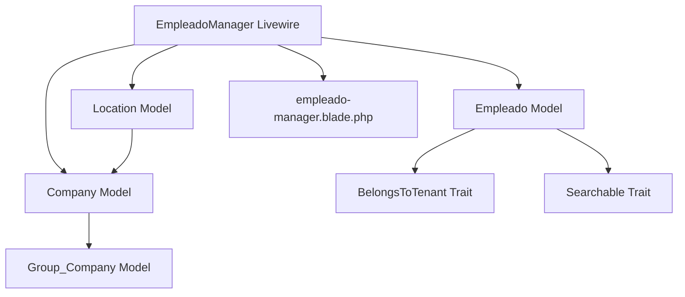
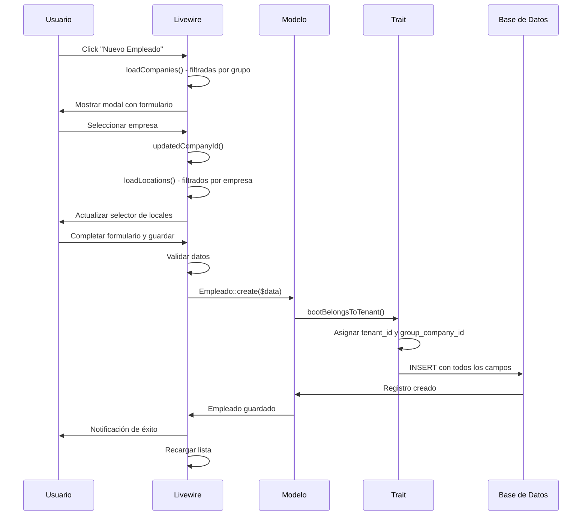
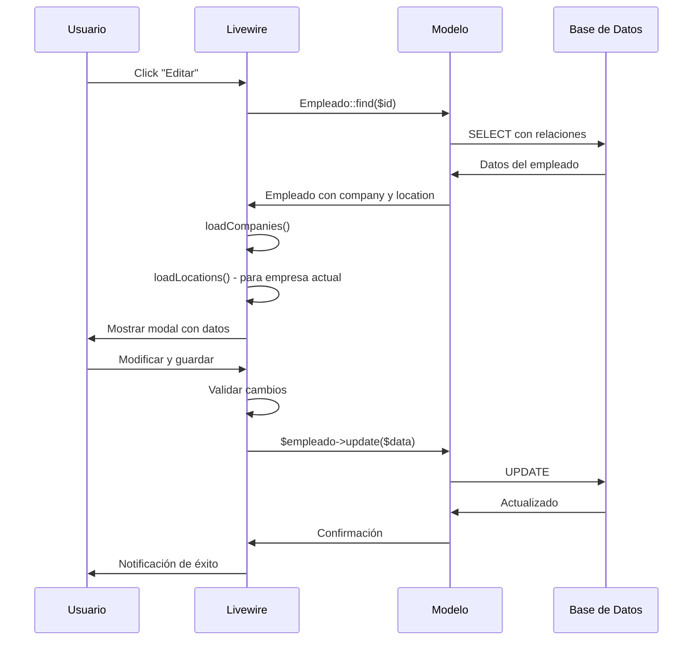
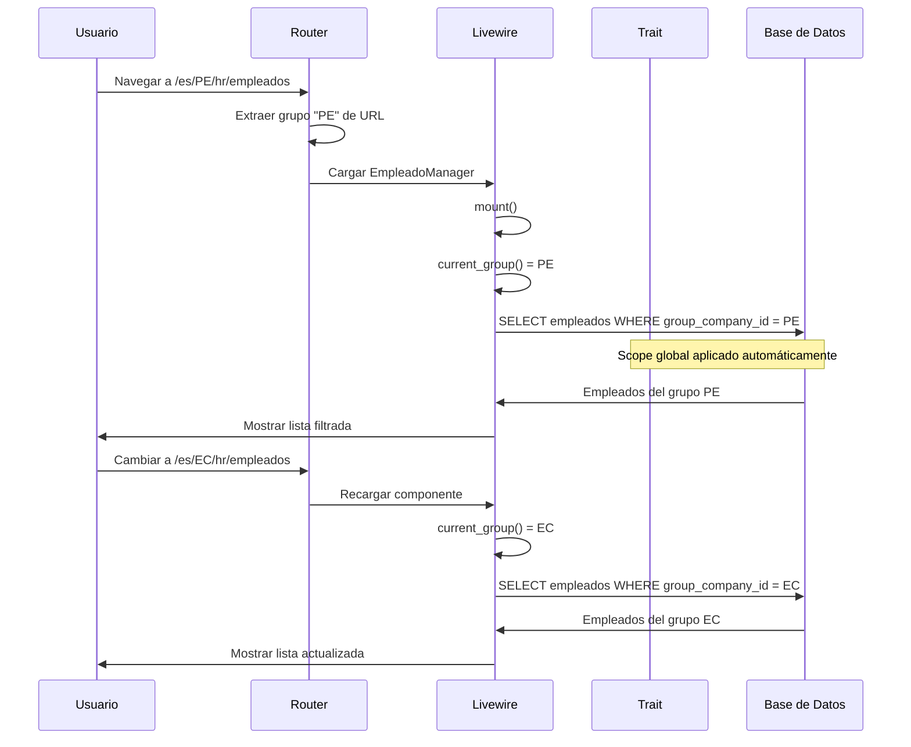
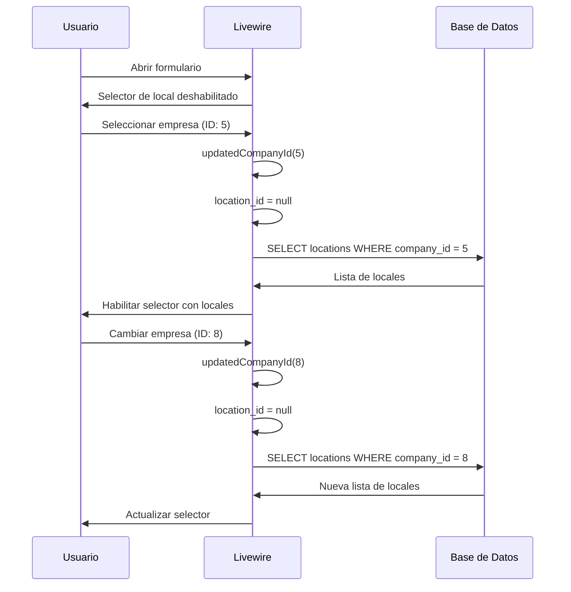

# Documento de Diseño

## Resumen

Este diseño refactoriza el módulo HR de empleados para alinear la estructura de datos con la jerarquía multi-tenant del sistema. Se elimina la relación many-to-many incorrecta con grupos y se establece que cada empleado pertenece a una empresa (Company) y un local (Location) específicos. El diseño incluye traits reutilizables para registro automático de contexto y búsqueda.

## Arquitectura

### Jerarquía de Datos

```
Tenant (Cliente SaaS)
  └─→ Group_Company (Operación por país: PE, EC, CO)
       └─→ Company (Empresa que factura: Multilens, Medilens)
            └─→ Empleado (Personal asignado)
            └─→ Location (Local/Sede: Lima, Huancayo, Arequipa) [Opcional]
                 └─→ Empleado (Personal asignado a local específico)
```

### Flujo de Contexto

1. Usuario navega a `/es/PE/hr/empleados`
2. Sistema extrae `group_company_id` del contexto (helper `current_group()`)
3. Sistema filtra automáticamente empleados por grupo
4. Usuario selecciona empresa (filtrada por grupo)
5. Usuario opcionalmente selecciona local (filtrado por empresa)
6. Sistema asigna automáticamente `tenant_id` y `group_company_id` al guardar

### Componentes Principales



## Componentes e Interfaces

### 1. Modelo Empleado

**Archivo:** `modules/HR/Models/Empleado.php`

**Responsabilidades:**
- Representar la entidad Empleado
- Definir relaciones con Tenant, Group_Company, Company, Location
- Aplicar scopes de filtrado por grupo
- Implementar soft deletes
- Usar traits para funcionalidad común

**Relaciones:**
```php
// Relación opcional con User (si el empleado tiene acceso al sistema)
belongsTo(User::class)->nullable()

// Relación con Tenant (muchos empleados pertenecen a un tenant)
belongsTo(Tenant::class)

// Relación con Group_Company (muchos empleados pertenecen a un grupo)
belongsTo(GroupCompany::class)

// Relación con Company (muchos empleados pertenecen a una empresa)
belongsTo(Company::class)

// Relación con Location (muchos empleados pueden pertenecer a un local - opcional)
belongsTo(Location::class)->nullable()
```

**Atributos:**
```php
protected $fillable = [
    'user_id',
    'nombre',
    'email',
    'documento_tipo',
    'documento_numero',
    'telefono',
    'company_id',
    'location_id',
    'codigo_empleado',
    'cargo',
    'fecha_ingreso',
    'fecha_cese',
    'estado',
];

protected $casts = [
    'estado' => 'integer',
    'fecha_ingreso' => 'date',
    'fecha_cese' => 'date',
    'created_at' => 'datetime',
    'updated_at' => 'datetime',
    'deleted_at' => 'datetime',
];
```

**Scopes:**
```php
// Filtrar por grupo actual
scopeForCurrentGroup($query)

// Filtrar por empresa
scopeForCompany($query, $companyId)

// Filtrar por local
scopeForLocation($query, $locationId)

// Filtrar por estado
scopeActive($query)
scopeSuspended($query)
```

### 2. Trait BelongsToTenant

**Archivo:** `app/Traits/BelongsToTenant.php`

**Responsabilidades:**
- Asignar automáticamente `tenant_id` y `group_company_id` al crear registros
- Aplicar scope global para filtrar por grupo actual
- Proporcionar métodos helper para contexto

**Métodos:**
```php
// Boot del trait - registra eventos y scopes
protected static function bootBelongsToTenant()

// Asignar tenant y grupo automáticamente
protected static function assignTenantAndGroup($model)

// Scope global para filtrar por grupo actual
protected static function addGlobalScope()
```

**Implementación:**
```php
trait BelongsToTenant
{
    protected static function bootBelongsToTenant()
    {
        // Asignar automáticamente en creación
        static::creating(function ($model) {
            if (empty($model->tenant_id)) {
                $model->tenant_id = auth()->user()->tenant_id ?? session('tenant_id');
            }
            
            if (empty($model->group_company_id)) {
                $model->group_company_id = current_group();
            }
        });
        
        // Aplicar scope global para filtrar por grupo
        static::addGlobalScope('group_company', function ($query) {
            if ($groupId = current_group()) {
                $query->where('group_company_id', $groupId);
            }
        });
    }
}
```

### 3. Trait Searchable

**Archivo:** `app/Traits/Searchable.php`

**Responsabilidades:**
- Proporcionar búsqueda flexible por múltiples campos
- Soportar búsqueda en relaciones
- Normalizar términos de búsqueda

**Métodos:**
```php
// Scope para búsqueda
scopeSearch($query, $term, $fields = [])

// Búsqueda en relaciones
scopeSearchRelation($query, $relation, $field, $term)
```

**Implementación:**
```php
trait Searchable
{
    public function scopeSearch($query, $term, $fields = [])
    {
        if (empty($term)) {
            return $query;
        }
        
        $fields = empty($fields) ? $this->searchable ?? [] : $fields;
        
        return $query->where(function ($q) use ($term, $fields) {
            foreach ($fields as $field) {
                $q->orWhere($field, 'LIKE', "%{$term}%");
            }
        });
    }
}
```

### 4. Componente Livewire EmpleadoManager

**Archivo:** `modules/HR/Livewire/EmpleadoManager.php`

**Responsabilidades:**
- Gestionar CRUD de empleados
- Manejar búsqueda y filtrado
- Cargar empresas y locales dinámicamente
- Validar datos antes de guardar
- Emitir notificaciones

**Propiedades:**
```php
// Listado
public $empleados;
public $search = '';
public $filterCompany = '';
public $filterLocation = '';
public $filterEstado = '';
public $perPage = 10;

// Formulario
public $empleadoId = null;
public $nombre = '';
public $email = '';
public $documento_tipo = 'DNI';
public $documento_numero = '';
public $telefono = '';
public $company_id = '';
public $location_id = '';
public $codigo_empleado = '';
public $cargo = '';
public $fecha_ingreso = '';
public $estado = 1;

// Datos auxiliares
public $companies = [];
public $locations = [];
public $showModal = false;
public $isEditing = false;
```

**Métodos Principales:**
```php
// Lifecycle
mount()
render()

// CRUD
create()
edit($id)
save()
delete($id)
restore($id)

// Auxiliares
loadCompanies()
loadLocations()
updatedCompanyId()
resetForm()
closeModal()

// Búsqueda y filtrado
updatedSearch()
updatedFilterCompany()
updatedFilterLocation()
updatedFilterEstado()

// Estado
toggleEstado($id)
```

### 5. Vista Blade

**Archivo:** `modules/HR/Resources/views/livewire/empleado-manager.blade.php`

**Responsabilidades:**
- Renderizar tabla de empleados
- Mostrar formulario modal
- Implementar selectores dependientes
- Mostrar estados visuales

**Secciones:**
- Barra de búsqueda y filtros
- Botón "Nuevo Empleado"
- Tabla con columnas: Código, Nombre, Documento, Cargo, Empresa, Local, Estado, Acciones
- Modal de formulario con campos básicos de RRHH
- Confirmaciones de eliminación

## Modelos de Datos

### Tabla: hr_empleados

```sql
CREATE TABLE hr_empleados (
    id BIGSERIAL PRIMARY KEY,
    
    -- Relación opcional con usuario del sistema (para acceso al sistema)
    user_id BIGINT NULL,
    
    -- Identificación personal
    nombre VARCHAR(255) NOT NULL,
    email VARCHAR(255) NOT NULL,  -- Para contacto, no para login
    documento_tipo VARCHAR(20),   -- DNI, CE, Pasaporte
    documento_numero VARCHAR(20),
    telefono VARCHAR(20),
    
    -- Jerarquía organizacional (asignación automática desde contexto)
    tenant_id BIGINT NOT NULL,
    group_company_id BIGINT NOT NULL,
    
    -- Asignación manual (usuario selecciona)
    company_id BIGINT NOT NULL,
    location_id BIGINT NULL,  -- Opcional
    
    -- Información laboral básica
    codigo_empleado VARCHAR(20),
    cargo VARCHAR(100),
    fecha_ingreso DATE,
    fecha_cese DATE NULL,
    
    -- Estado
    estado INTEGER DEFAULT 1,  -- 1=activo, 0=suspendido, 2=cesado
    
    -- Timestamps
    created_at TIMESTAMP DEFAULT NOW(),
    updated_at TIMESTAMP DEFAULT NOW(),
    deleted_at TIMESTAMP NULL,
    
    -- Constraints
    CONSTRAINT fk_empleado_user 
        FOREIGN KEY (user_id) REFERENCES users(id) ON DELETE SET NULL,
    CONSTRAINT fk_empleado_tenant 
        FOREIGN KEY (tenant_id) REFERENCES tenants(id) ON DELETE CASCADE,
    CONSTRAINT fk_empleado_group 
        FOREIGN KEY (group_company_id) REFERENCES group_companies(id) ON DELETE CASCADE,
    CONSTRAINT fk_empleado_company 
        FOREIGN KEY (company_id) REFERENCES companies(id) ON DELETE CASCADE,
    CONSTRAINT fk_empleado_location 
        FOREIGN KEY (location_id) REFERENCES locations(id) ON DELETE SET NULL,
    
    -- Unique constraints
    CONSTRAINT uk_empleado_documento UNIQUE (documento_numero),
    CONSTRAINT uk_empleado_codigo UNIQUE (codigo_empleado)
);

-- Índices para rendimiento
CREATE INDEX idx_empleados_user ON hr_empleados(user_id);
CREATE INDEX idx_empleados_tenant ON hr_empleados(tenant_id);
CREATE INDEX idx_empleados_group ON hr_empleados(group_company_id);
CREATE INDEX idx_empleados_company ON hr_empleados(company_id);
CREATE INDEX idx_empleados_location ON hr_empleados(location_id);
CREATE INDEX idx_empleados_email ON hr_empleados(email);
CREATE INDEX idx_empleados_documento ON hr_empleados(documento_numero);
CREATE INDEX idx_empleados_codigo ON hr_empleados(codigo_empleado);
CREATE INDEX idx_empleados_estado ON hr_empleados(estado);
CREATE INDEX idx_empleados_deleted ON hr_empleados(deleted_at);
```

**Notas sobre la estructura:**

1. **user_id (opcional)**: Permite vincular un empleado con un usuario del sistema si necesita acceso. No todos los empleados necesitan login.

2. **email**: Ya no es único globalmente porque es solo para contacto. Si el empleado necesita acceso al sistema, se crea un `user` con email único.

3. **documento_numero**: Único para evitar duplicados de empleados.

4. **codigo_empleado**: Código interno de la empresa para identificar al empleado (ej: EMP-001).

5. **Campos básicos de RRHH**: documento, teléfono, cargo, fecha_ingreso - información mínima necesaria.

### Eliminación de Tabla

```sql
-- Eliminar tabla de relación many-to-many incorrecta
DROP TABLE IF EXISTS hr_empleado_group_access;
```

## Flujos de Operación

### Flujo 1: Crear Empleado



### Flujo 2: Editar Empleado



### Flujo 3: Filtrado Automático por Grupo



### Flujo 4: Selector Dependiente de Locales



## Propiedades de Corrección

Una propiedad es una característica o comportamiento que debe mantenerse verdadero en todas las ejecuciones válidas del sistema, esencialmente una declaración formal sobre lo que el sistema debe hacer. Las propiedades sirven como puente entre especificaciones legibles por humanos y garantías de corrección verificables por máquina.

### Propiedad 1: Asignación Automática de Contexto

*Para cualquier* empleado creado, el sistema debe asignar automáticamente tenant_id y group_company_id desde el contexto actual sin requerir entrada del usuario.

**Valida: Requisitos 1.2**

### Propiedad 2: Campos de Jerarquía Requeridos

*Para cualquier* empleado almacenado en la base de datos, debe tener valores no nulos para tenant_id, group_company_id y company_id. El campo location_id puede ser NULL.

**Valida: Requisitos 1.1, 1.4**

### Propiedad 3: Validación de Campos Manuales

*Para cualquier* intento de crear un empleado sin company_id, el sistema debe rechazar la operación con un error de validación. El campo location_id es opcional.

**Valida: Requisitos 1.3**

### Propiedad 4: Restricciones de Integridad Referencial

*Para cualquier* intento de crear un empleado con tenant_id, group_company_id o company_id que no existan en sus tablas respectivas, el sistema debe rechazar la operación. Si se proporciona location_id, debe existir en la tabla locations.

**Valida: Requisitos 1.6**

### Propiedad 5: Filtrado Automático por Grupo

*Para cualquier* consulta de lista de empleados, el sistema debe retornar solo empleados cuyo group_company_id coincida con el grupo actual del contexto.

**Valida: Requisitos 2.1, 2.3**

### Propiedad 6: Actualización de Contexto

*Para cualquier* cambio de grupo en el contexto (cambio de URL), el sistema debe actualizar automáticamente la lista de empleados para mostrar solo los del nuevo grupo.

**Valida: Requisitos 2.2**

### Propiedad 7: Filtrado de Empresas por Grupo

*Para cualquier* lista de empresas disponibles en el formulario de empleado, todas las empresas retornadas deben pertenecer al group_company_id actual.

**Valida: Requisitos 3.1**

### Propiedad 8: Validación de Empresa Pertenece al Grupo

*Para cualquier* intento de guardar un empleado, si el company_id no pertenece al grupo actual, el sistema debe rechazar la operación con un error de validación.

**Valida: Requisitos 3.4, 7.4**

### Propiedad 9: Filtrado de Locales por Empresa

*Para cualquier* empresa seleccionada, la lista de locales disponibles debe contener solo locales cuyo company_id coincida con la empresa seleccionada.

**Valida: Requisitos 4.1**

### Propiedad 10: Reset de Local al Cambiar Empresa

*Para cualquier* cambio de empresa seleccionada en el formulario, el valor de location_id debe resetearse a null.

**Valida: Requisitos 4.3**

### Propiedad 11: Validación de Local Pertenece a Empresa

*Para cualquier* intento de guardar un empleado con location_id no nulo, si el location_id no pertenece al company_id seleccionado, el sistema debe rechazar la operación con un error de validación.

**Valida: Requisitos 4.4, 7.5**

### Propiedad 12: Consultas Eficientes Sin N+1

*Para cualquier* carga de lista de empleados con sus relaciones (empresa y local), el sistema debe ejecutar como máximo 3 consultas SQL (empleados, empresas, locales) independientemente del número de registros.

**Valida: Requisitos 5.3, 12.2, 12.4**

### Propiedad 13: Creación de Empleados Válidos

*Para cualquier* empleado con todos los campos requeridos válidos, el sistema debe permitir su creación y persistencia en la base de datos.

**Valida: Requisitos 6.1**

### Propiedad 14: Actualización de Empleados

*Para cualquier* empleado existente, el sistema debe permitir actualizar sus campos manteniendo la integridad referencial y las validaciones.

**Valida: Requisitos 6.2**

### Propiedad 15: Eliminación Lógica

*Para cualquier* empleado eliminado, el sistema debe establecer el campo deleted_at con un timestamp y no eliminar físicamente el registro.

**Valida: Requisitos 6.3**

### Propiedad 16: Restauración de Empleados

*Para cualquier* empleado con deleted_at no nulo, el sistema debe permitir restaurarlo estableciendo deleted_at a null.

**Valida: Requisitos 6.4**

### Propiedad 17: Preservación de Relaciones al Eliminar

*Para cualquier* empleado eliminado lógicamente, todas sus relaciones (tenant_id, group_company_id, company_id, location_id si existe) deben permanecer intactas.

**Valida: Requisitos 6.5**

### Propiedad 18: Validación de Nombre

*Para cualquier* intento de crear o actualizar un empleado con nombre vacío o mayor a 255 caracteres, el sistema debe rechazar la operación con un error de validación.

**Valida: Requisitos 7.1**

### Propiedad 19: Validación de Email

*Para cualquier* intento de crear o actualizar un empleado con email vacío, inválido o duplicado, el sistema debe rechazar la operación con un error de validación.

**Valida: Requisitos 7.2**

### Propiedad 20: Validación de Password

*Para cualquier* intento de crear un empleado nuevo sin password o con password que no cumpla requisitos mínimos, el sistema debe rechazar la operación con un error de validación.

**Valida: Requisitos 7.3**

### Propiedad 21: Búsqueda por Nombre o Email

*Para cualquier* término de búsqueda, todos los empleados retornados deben contener el término en su nombre o email (case-insensitive).

**Valida: Requisitos 8.1**

### Propiedad 22: Filtrado por Estado

*Para cualquier* filtro de estado aplicado (activo o suspendido), todos los empleados retornados deben tener el estado correspondiente.

**Valida: Requisitos 8.3**

### Propiedad 23: Filtrado por Empresa

*Para cualquier* filtro de empresa aplicado, todos los empleados retornados deben pertenecer a esa empresa.

**Valida: Requisitos 8.4**

### Propiedad 24: Filtrado por Local

*Para cualquier* filtro de local aplicado, todos los empleados retornados deben pertenecer a ese local. Si se filtra por "sin local", deben retornarse empleados con location_id NULL.

**Valida: Requisitos 8.5**

### Propiedad 25: Estado como Entero Binario

*Para cualquier* empleado en la base de datos, el campo estado debe ser 0 (suspendido) o 1 (activo).

**Valida: Requisitos 9.1**

### Propiedad 26: Alternancia de Estado

*Para cualquier* empleado con estado activo (1), al alternar debe cambiar a suspendido (0), y viceversa.

**Valida: Requisitos 9.2**

### Propiedad 27: Persistencia de Cambio de Estado

*Para cualquier* cambio de estado de un empleado, el nuevo valor debe persistirse inmediatamente en la base de datos.

**Valida: Requisitos 9.4**

### Propiedad 28: Límite de Paginación

*Para cualquier* consulta paginada de empleados, el número de registros retornados no debe exceder el límite configurado de elementos por página.

**Valida: Requisitos 12.1**

## Manejo de Errores

### Errores de Validación

**Escenarios:**
- Campos requeridos faltantes (nombre, email, password, company_id)
- Formato de email inválido
- Email duplicado
- Nombre excede 255 caracteres
- Password no cumple requisitos mínimos
- company_id no pertenece al grupo actual
- location_id (si se proporciona) no pertenece a la empresa seleccionada
- IDs de relaciones no existen

**Respuesta:**
```php
// Retornar errores de validación
return [
    'errors' => [
        'campo' => ['Mensaje de error en español']
    ]
];

// En Livewire, usar $this->addError()
$this->addError('email', 'El email ya está en uso.');
```

### Errores de Integridad Referencial

**Escenarios:**
- Intentar asignar tenant_id inexistente
- Intentar asignar group_company_id inexistente
- Intentar asignar company_id inexistente
- Intentar asignar location_id inexistente

**Respuesta:**
```php
try {
    $empleado->save();
} catch (\Illuminate\Database\QueryException $e) {
    if ($e->getCode() === '23000') {
        // Violación de constraint de clave foránea
        $this->addError('general', 'Error de integridad de datos.');
    }
}
```

### Errores de Autorización

**Escenarios:**
- Usuario intenta acceder a empleados de otro grupo
- Usuario intenta crear empleado en empresa de otro grupo

**Respuesta:**
```php
// Usar scope global para prevenir acceso
// Si se intenta bypass, retornar 403
abort(403, 'No autorizado para acceder a este recurso.');
```

### Errores de Estado

**Escenarios:**
- Intentar restaurar empleado no eliminado
- Intentar eliminar empleado ya eliminado

**Respuesta:**
```php
if ($empleado->trashed()) {
    $this->addError('general', 'El empleado ya está eliminado.');
    return;
}
```

## Estrategia de Testing

### Enfoque Dual de Testing

El sistema implementará dos tipos complementarios de pruebas:

1. **Pruebas Unitarias**: Verifican ejemplos específicos, casos borde y condiciones de error
2. **Pruebas Basadas en Propiedades**: Verifican propiedades universales a través de múltiples entradas generadas

Ambos tipos son necesarios para cobertura completa. Las pruebas unitarias capturan bugs concretos, mientras que las pruebas de propiedades verifican corrección general.

### Configuración de Pruebas de Propiedades

**Librería:** Se utilizará una librería de property-based testing para PHP. Las opciones incluyen:
- **Eris** (recomendada para PHP)
- **php-quickcheck**

**Configuración:**
- Mínimo 100 iteraciones por prueba de propiedad
- Cada prueba debe referenciar su propiedad del documento de diseño
- Formato de etiqueta: `@test Feature: refactor-empleados-jerarquia, Property N: [texto de propiedad]`

### Pruebas Unitarias

**Áreas de Enfoque:**
- Ejemplos específicos de validación
- Casos borde (strings vacíos, límites de longitud)
- Condiciones de error (IDs inexistentes, violaciones de constraints)
- Integración entre componentes (Livewire ↔ Model)

**Ejemplos:**
```php
// Caso específico: email duplicado
public function test_cannot_create_empleado_with_duplicate_email()
{
    $existing = Empleado::factory()->create(['email' => 'test@example.com']);
    
    $this->expectException(ValidationException::class);
    
    Empleado::create([
        'nombre' => 'Nuevo',
        'email' => 'test@example.com',
        'password' => bcrypt('password'),
        'company_id' => 1,
        'location_id' => 1,
    ]);
}

// Caso borde: nombre en límite de 255 caracteres
public function test_can_create_empleado_with_255_character_name()
{
    $nombre = str_repeat('a', 255);
    
    $empleado = Empleado::create([
        'nombre' => $nombre,
        'email' => 'test@example.com',
        'password' => bcrypt('password'),
        'company_id' => 1,
        'location_id' => 1,
    ]);
    
    $this->assertEquals($nombre, $empleado->nombre);
}
```

### Pruebas de Propiedades

**Áreas de Enfoque:**
- Propiedades universales que deben mantenerse para todas las entradas
- Validaciones que aplican a rangos de valores
- Invariantes del sistema
- Comportamientos de filtrado y búsqueda

**Ejemplos:**
```php
use Eris\Generator;

/**
 * @test
 * Feature: refactor-empleados-jerarquia, Property 2: Campos de Jerarquía Requeridos
 */
public function property_all_empleados_have_required_hierarchy_fields()
{
    $this->forAll(
        Generator\associative([
            'nombre' => Generator\string(),
            'email' => Generator\email(),
            'password' => Generator\string(),
            'company_id' => Generator\choose(1, 100),
            'location_id' => Generator\choose(1, 100),
        ])
    )
    ->then(function ($data) {
        // Crear empleado con datos generados
        $empleado = Empleado::create($data);
        
        // Verificar que todos los campos de jerarquía estén presentes
        $this->assertNotNull($empleado->tenant_id);
        $this->assertNotNull($empleado->group_company_id);
        $this->assertNotNull($empleado->company_id);
        $this->assertNotNull($empleado->location_id);
    });
}

/**
 * @test
 * Feature: refactor-empleados-jerarquia, Property 5: Filtrado Automático por Grupo
 */
public function property_list_only_returns_empleados_from_current_group()
{
    $this->forAll(
        Generator\choose(1, 10) // group_company_id
    )
    ->then(function ($groupId) {
        // Simular contexto de grupo
        session(['group_company_id' => $groupId]);
        
        // Obtener lista de empleados
        $empleados = Empleado::all();
        
        // Verificar que todos pertenezcan al grupo actual
        foreach ($empleados as $empleado) {
            $this->assertEquals($groupId, $empleado->group_company_id);
        }
    });
}

/**
 * @test
 * Feature: refactor-empleados-jerarquia, Property 21: Búsqueda por Nombre o Email
 */
public function property_search_returns_only_matching_empleados()
{
    $this->forAll(
        Generator\string()
    )
    ->then(function ($searchTerm) {
        if (empty($searchTerm)) {
            return; // Skip empty searches
        }
        
        // Buscar empleados
        $empleados = Empleado::search($searchTerm, ['nombre', 'email'])->get();
        
        // Verificar que todos contengan el término
        foreach ($empleados as $empleado) {
            $matches = stripos($empleado->nombre, $searchTerm) !== false ||
                      stripos($empleado->email, $searchTerm) !== false;
            $this->assertTrue($matches);
        }
    });
}
```

### Cobertura de Testing

**Objetivo:** Cada propiedad de corrección debe tener al menos una prueba de propiedad correspondiente.

**Mapeo Propiedad → Prueba:**
- Propiedad 1 → test_property_automatic_context_assignment
- Propiedad 2 → test_property_required_hierarchy_fields
- Propiedad 3 → test_property_manual_fields_validation
- ... (continuar para todas las 28 propiedades)

### Ejecución de Pruebas

```bash
# Ejecutar todas las pruebas
php artisan test

# Ejecutar solo pruebas unitarias
php artisan test --testsuite=Unit

# Ejecutar solo pruebas de propiedades
php artisan test --testsuite=Feature --filter=property_

# Ejecutar con cobertura
php artisan test --coverage
```

## Consideraciones de Implementación

### Orden de Implementación

1. **Traits** (BelongsToTenant, Searchable) - Base reutilizable
2. **Migraciones** - Estructura de datos
3. **Modelo Empleado** - Lógica de negocio
4. **Componente Livewire** - Interfaz y controlador
5. **Vista Blade** - Presentación
6. **Pruebas** - Validación

### Compatibilidad con Código Existente

**Migración Gradual:**
- Mantener compatibilidad temporal con código que use la estructura antigua
- Proporcionar período de transición para actualizar referencias
- Documentar cambios breaking

**Datos Existentes:**
- Migración debe manejar empleados sin company_id/location_id
- Asignar valores predeterminados basados en lógica de negocio
- Registrar empleados que requieran asignación manual

### Rendimiento

**Optimizaciones:**
- Índices en columnas de clave foránea
- Eager loading de relaciones
- Caché de listas de empresas y locales por grupo
- Paginación para grandes volúmenes

**Monitoreo:**
- Registrar tiempo de consultas
- Alertar sobre consultas N+1
- Medir tiempo de carga de página

### Seguridad

**Protecciones:**
- Scope global previene acceso cross-group
- Validación de pertenencia de empresa al grupo
- Validación de pertenencia de local a empresa
- Hash de passwords con bcrypt
- Sanitización de entradas

**Auditoría:**
- Registrar creación, actualización, eliminación de empleados
- Registrar cambios de estado
- Registrar intentos de acceso no autorizado
